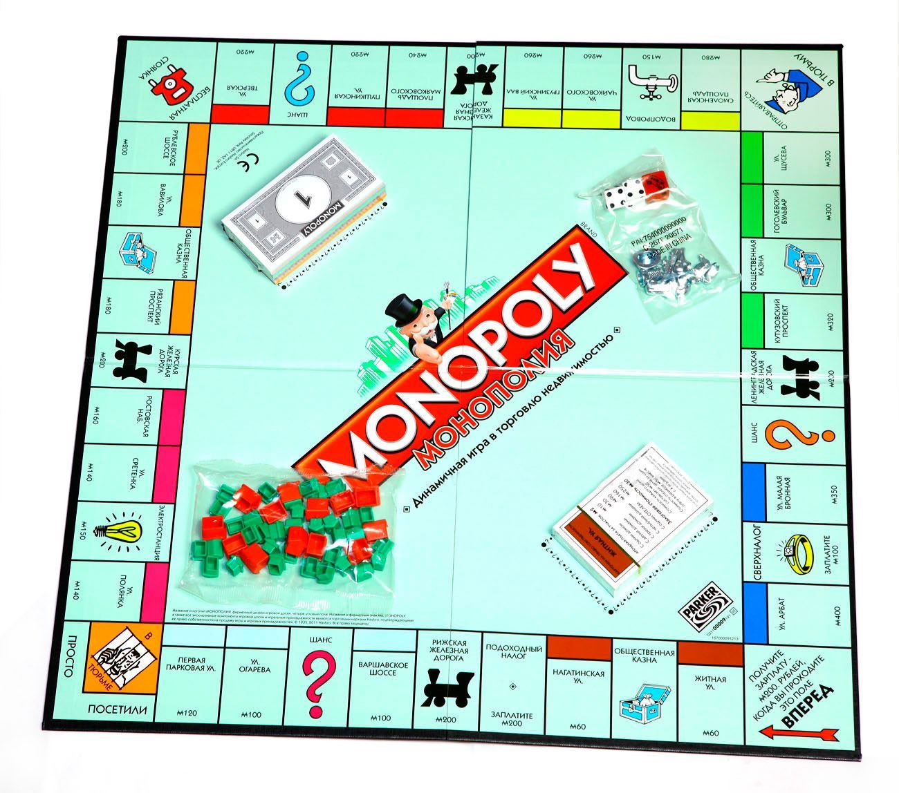
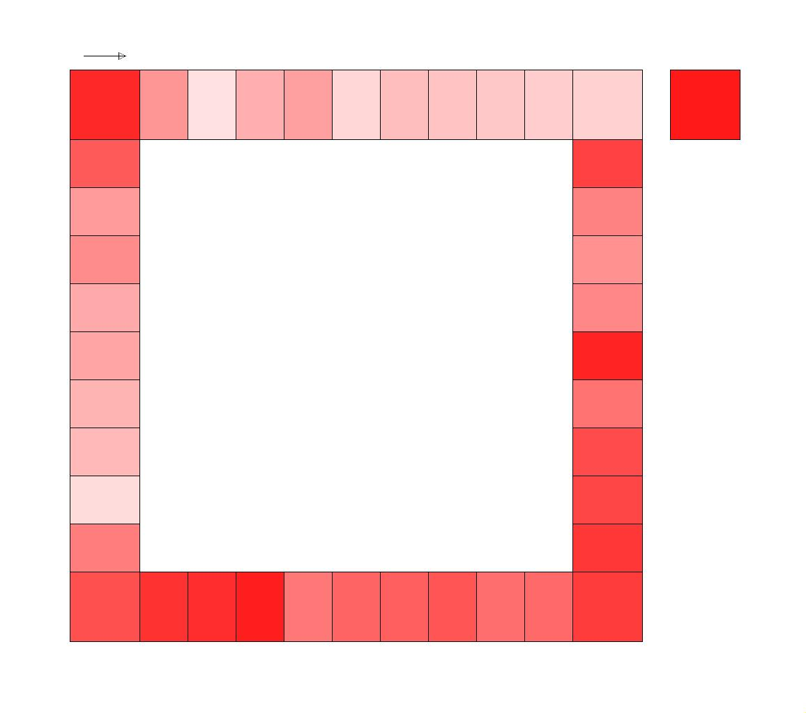

# Monopoly immitation
Imitation of a very long gaming session in a monopoly + visualization of heatmap in .ppm file.

## Setup
A classic gaming field with standart set of gaming cards was used.

## Run
To build code just use simple Makefile. 
Run program with '-l' flag to see the log of the game.

## Example
